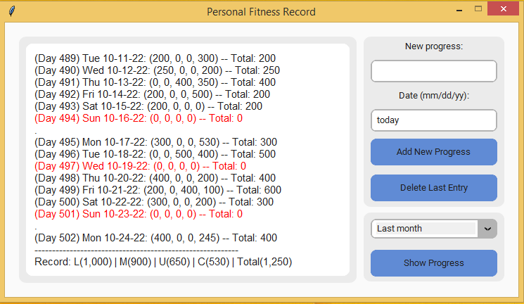
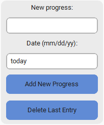
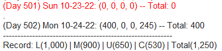
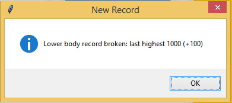
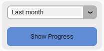
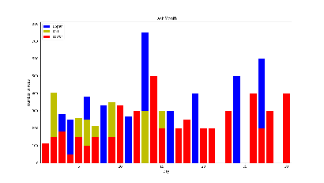
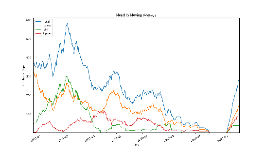

# Personal Fitness Tracker

Fitness tracking is an essential part of working out. It lets you view your progress over months and years. Additionally, it helps encourage you to 
do your best so that your numbers get better. Nowadays, there are many fitness tracking apps, both free and paid, on the market. However, I found
most of them too complicated, including too many features that I will never need. Therefore, I created my own fitness tracking program to best fit
my persoanl training program. You can tweak the code to make it fit your own training program, too.

## Description



Program GUI was created using CustomTkinter module for a modern look. Matplotlib module was used to plot your progress.

## Getting Started

### Dependencies

To be able to use the program, you should install the following modules:

```
pip install customtkinter
pip install matplotlib
pip install pandas
```

### Installing

To download this program, enter the following command in your terminal:
```
git clone https://github.com/erichoangnle/fitness.git
```

### Usage

#### Input new progress



Add new progress by entering 4 numbers, separated by a single space, representing the total number of reps for the following exercices: pushup, pullup, squat,
and deadlift. You can tweak the code by changing how many exercices you want to keep track or changing input format to your liking.

The date entry field's default value is "today". The program will automatically get today's date. If you are logging your progress for any other day, 
manually enter the date by the following format: (mm/dd/yy).

#### Fitness activities history



Your rest days will be printed in red, while days with non-zero activities will be printed in black. Weeks are separated by a single comma on the line.
The last line in the display is your personal record for each exercise. You can change the code to alter display format to your liking.

#### Personal best



Every time you enter new progress, the program will automatically check if you have broken any of your personal best. If you have, it will
let you know.

#### Show progress



You can choose your graph or plot method to see your progress over time. Currently, the default modes are: plotting your activities for last month, 
graphing your weekly average and monthly average activities.

Last month progress:



Monthly moving average:



The plots and graphs are generated using Matplotlib module. You can read Matplotlib module's documentation and implement other graphing or 
plotting method to fit your needs.

## Contact

Email: erichoangnle@gmail.com

Facebook: https://www.facebook.com/eric.le.520900

Project link: https://github.com/erichoangnle/fitness.git
